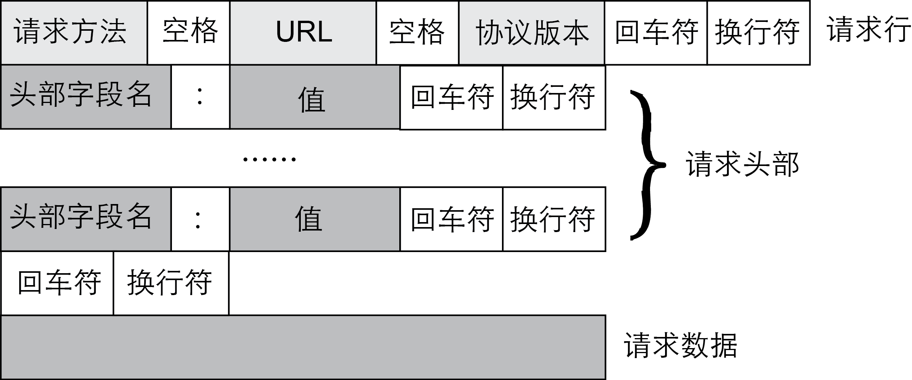
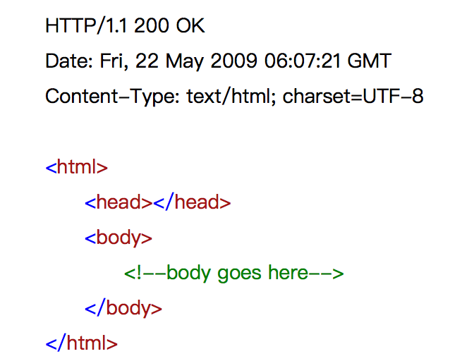

简介
=======================================

概述
---------------------------------------
传统命令行界面，封闭且不够灵活，面对ConnetOS上的诸多开放特性，显得力不从心。

而API（Application Programming Interface，应用程序编程接口）可以提供传统CLI所做的一切，用户可以进行配置、状态查询和故障定位。同时，由于API的开放特性，可以提供给用户更丰富的使用场景，包括基于API的二次开发，从而极大的增强ConnetOS的开放性。

RESTful API（Representational State Transfer，表述性状态迁移），提供了一种使用API来灵活的管理设备和查询设备运行状态的机制。

原理描述
---------------------------------------
API采用HTTP协议传递数据，即通过URL向HTTP服务端即Web服务器发送所有请求，Web服务器根据接收到的请求后，向客户端发送响应信息。

＃此处是不是要增加一下认证的过程。
第一次访问想要进行授权。
在token有效时间内访问，不需要再次认证，直接携带token访问即可。

消息请求Request
+++++++++++++++++++++++++++++++++++++++

客户端发送一个HTTP请求到服务器的请求消息包括以下格式：

请求行（request line）、请求头部（header）、空行和请求数据四个部分组成。

请求消息结构如下图所示。

* 第一部分：请求行，用来说明请求类型，要访问的资源以及所使用的HTTP版本。
* 第二部分：请求头部，紧接着请求行（即第一行）之后的部分，用来说明服务器要使用的附加信息。
* 第三部分：空行，请求头部后面的空行是必须的。
* 第四部分：请求数据也叫主体，可以添加任意的其他数据。

HTTP请求类型
^^^^^^^^^^^^^^^^^^^^^^^^^^^^^^^^^^^^^^^
ConnetOS支持的请求类型如下表所示：

===========  ====================================
操作          含义   
===========  ====================================
POST         创建。
PUT          更新。如果资源存在就覆盖，不存在就创建
GET          读取。
PATCH        修改。相对于PUT只修改单独的参数
DELETE       删除
===========  ====================================

.. note:: 
    
    RESTful API和API最大的区别就是严格遵守请求类型的定义。如POST只创建，不修改。

消息回应Respone
+++++++++++++++++++++++++++++++++++++++
一般情况下，服务器接收并处理客户端发过来的请求后会返回一个HTTP的响应消息。

HTTP响应也由四个部分组成，分别是：状态行、消息报头、空行和响应正文。

* 第一部分：状态行，由HTTP协议版本号， 状态码， 状态消息 三部分组成。

  第一行为状态行，（HTTP/1.1）表明HTTP版本为1.1版本，状态码为200，状态消息为（ok）。

* 第二部分：消息报头，用来说明客户端要使用的一些附加信息。

  第二行和第三行为消息报头：
  Date:生成响应的日期和时间；Content-Type:指定了MIME类型的HTML(text/html),编码类型是UTF-8。

* 第三部分：空行，消息报头后面的空行是必须的。

* 第四部分：响应正文，服务器返回给客户端的文本信息。

HTTP状态码
^^^^^^^^^^^^^^^^^^^^^^^^^^^^^^^^^^^^^^^
状态代码有三位数字组成，第一个数字定义了响应的类别，共分五种类别:

========  ======================================== 
状态码     含义                                     
========  ========================================
1xx       指示信息。表示请求已接收，继续处理    
2xx       成功。表示请求已被成功接收、理解、接受
3xx       重定向。要完成请求必须进行更进一步的操作
4xx       客户端错误。请求有语法错误或请求无法实现
5xx       服务器端错误。服务器未能实现合法的请求
========  ========================================

常见状态码有：

==============================   ============================================================== 
状态码                            含义
==============================   ==============================================================  
200 OK                           客户端请求成功
400 Bad Request                  客户端请求有语法错误，不能被服务器所理解
401 Unauthorized                 请求未经授权，这个状态代码必须和WWW-Authenticate报头域一起使用 
403 Forbidden                    服务器收到请求，但是拒绝提供服务
404 Not Found                    请求资源不存在，eg：输入了错误的URL
500 Internal Server Error        服务器发生不可预期的错误
503 Server Unavailable           服务器当前不能处理客户端的请求，一段时间后可能恢复正常
==============================   ============================================================== 

使用指导
---------------------------------------

ConnetOS支持的RESTful API功能，API分为两种：

* +config+

  对于+config+类型的API，ConnetOS用户可以将想要下发的配置以JSON文本的格式发送给相关联的API使之生效，并且可以使用标准的HTTP方法来查询(GET)、更新(PUT)、修改(PATCH)以及删除(DEL)配置。

* +state+

  用户可以使用+state+类型的API来查询当前系统的运行状态，查询结果将以JSON文本的格式返回给用户。
  
同时，ConnetOS提供一个轻量级的配置管理工具(基于SwaggerUI)来方便的进行API调用，这个管理工具提供了JSON格式的配置模板、每个API支持的http方法和相关的错误码解释，用户可以基于这个模板来填充配置。

ConnetOS的RESTful API功能通过swagger修改，下面以修改IP地址为“http://192.168.1.36”的设备上的QoS功能为例，说明如何通过RESTful API功能配置功能特性。

#. 登录指定设备的，登录的URL网址为：http://192.168.1.36:8080/public/v1/
   
   .. image:: Swagger_UI.png
       :width: 400

#. 根据需要，选择对应功能的操作方式。
   
   .. image:: qos_operation.png
       :width: 400

#. 点击“Try it out”，修改配置项。修改完成后点击execute。

   .. image:: execute.png
       :width: 400

#. 查看返回的状态码，如果OK，代表配置成功。否则根据返回码查看原因。

